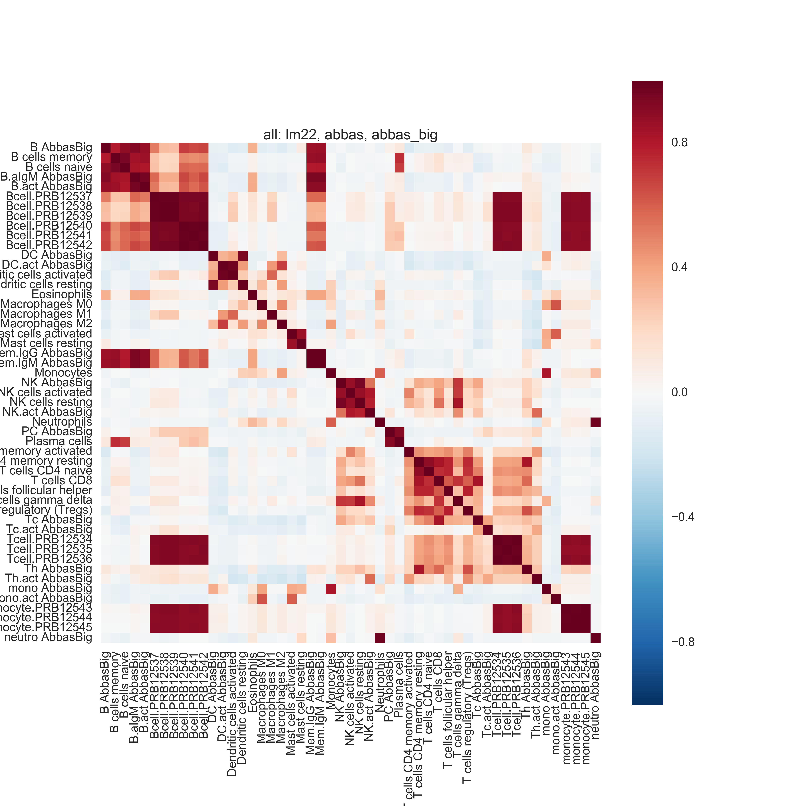

# Introduction

Several groups have introduced methods for the deconvolution of bulk tumor gene expression data. Every method includes a unique procedure for isolating a reference profile corresponding to each cell type using sample gene expression data collected from enriched cell lines. For robust deconvolution, it is essential that these reference profiles -- taking the form of marker gene lists or characteristic gene expression vectors -- are determined carefully. Specifically, we are interested in the following properties of these methods:

* Do these training methods extract biological intuition or noise?
* How well do their selected genes or expression vectors differentiate between similar classes?
* How well can these methods differentiate all classes, based on metrics like condition number?
* Do their chosen genes overlap, and are the differences between their training expression vectors or marker genes biologically significant or noise? 
* How unique are genes to individual cell types? How many are shared between multiple types?

We introduce each approach, discuss its theoretical limitations, and examine its output to understand whether there is motivation for new approaches.

# Methods for selecting reference profiles

## Marker gene methods

There are three notable methods that produce marker gene lists. First, @iris examined gene expression within immune cell types and in other tissue to produce a list of genes that are specifically expressed in particular immune cell types. To determine whether a certain gene $g$ is exemplary of any cell type(s), the authors find the array with the highest expression level of $g$ and determine which enriched cell type it corresponds to. They multiply this highest expression level by $0.1625$ (chosen arbitrarily) and add the maximum expression level of $g$ seen in non-immune tissue samples. If this weighted sum is greater than the next highest expression level of gene $g$ across arrays from other immune cell types, then $g$ is considered characteristic of the cell type in which it was most highly expressed. Finally, if this gene has higher expression in another immune cell type than this weighted sum, the gene is also considered to be characteristic of the other cell type.

However, fold change alone is a poor indicator of uniqueness; high expression should not be the only indicator that a gene corresponds to a particular cell type! A more robust method would consider rare expression, even at low levels.

@bindea pursues the same task with a similar method. To determine whether the  expression of gene $g$ is characteristic of cell type $t$, the authors essentially compute the score:
$$
\Delta_{g,t} = \min_{e_i \in X_t}(e_i(g)) - \max_{t' \in T-\{t\}} ( \text{mean}_{e_j \in X_{t'}}(e_j(g))),
$$
where $X_{i}$ is the set of all arrays of cell type $i$ and $e(g)$ is the expression of $g$ in some array. Then, they keep all $g$'s with highest $\Delta_{g,t}$. The authors do not specify their filtering cutoff, unfortunately. The authors finally add some cell type-specific genes for populations not sampled, again without much detail (the code is not available).

This filtering mechanism ensures that selected genes are unique to their corresponding cell types, but would fail if any two types are very similar. In this case, genes whose differential expression has biological meaning but is small might not pass the filter, whereas genes with seemingly high differential expression -- as may be found in the noise from low sample sizes -- may pass.

Finally, though @estimate attempts to estimate tumor purity, which is the absolute fraction of stromal and immune cells in a tumor sample, instead of the relative abundances of specific immune infiltrate cell types, the method also relies on identifying immune signature genes from gene expression in enriched samples and thus deserves investigation. The authors simply divided samples into extremely low and extremely high immune cell infiltration groups (using leukocyte methylation signature scores that are given in many TCGA datasets), removing any samples with medium immune cell infiltration. They computed Significance Analysis of Microarray (SAM) scores on the differential expression of genes between the high-and low-infiltration groups [@sam]. They selected genes that were significantly differentially expressed to form a gene list.

SAM is a straightforward, well-known, and statistically sound method for finding genes that are differentially expressed between two classes. Moreover, the SAM technique can be applied to multi-class situations to determine genes that are significantly differentially expressed in one combination of cell types versus another. I believe SAM would form more robust gene lists in comparison to previous methods that are based solely on fold change.

### Analysis

Our first measure of whether these marker gene extraction methods are successful is whether known immune pathways are enriched in the gene list. For example, are the genes that these methods believe to be associated with T cells part of the T cell receptor signaling pathway, or are these methods pulling out noise? 

The two marker gene lists, which we call IRIS @iris and Bindea @bindea, do not have much agreement on B cells or T cells; on NK cells, there are no intersecting genes at all. We run gene ontology enrichment analysis on the genes they have in common and on the genes unique to each list to see which T cell pathways are found and where. The resulting significant ($p<.001$) GO terms are contained in the tables below. Though the genes are different, they belong to the same pathways. The IRIS list contains much more noise than the Bindea list. This suggests that the method of @Bindea is more effective at extracting the unique properties of each immune cell subtype.

---
# \fixme{Marker genes --> GO to see if have biological annotation. Look for T cell receptor signaling.
# Result: T cell from IRIS show T cell receptor signaling.
# IRIS and Bindea don't intersect much on B cells or T cells. On NK cells, no intersection at all! What's going on? Still have some biological information in there. Are they different genes from the same pathways?
# Next step: run intersection and unique lists through GO and see which list has noise vs actual information.}
# \fixme{How many genes are shared between classes? Are the classes very close together?} Maybe this will also help distinguish the methods.
---

GO terms in intersection of T cell IRIS and Bindea marker gene lists:

---
# awk -F '\t' '{print $8}' Tcells_intersect_iris_bindea.tsv
---

\begin{multicols}{2}
\begin{enumerate}
\item T cell receptor signaling pathway
\item antigen receptor-mediated signaling pathway
\item T cell costimulation
\item lymphocyte costimulation
\item immune response-activating cell surface receptor signaling pathway
\item T cell activation
\item T cell aggregation
\item lymphocyte aggregation
\item leukocyte aggregation
\item T cell selection
\item leukocyte cell-cell adhesion
\item immune response-activating signal transduction
\item positive regulation of T cell activation
\item homotypic cell-cell adhesion
\item positive regulation of homotypic cell-cell adhesion
\item positive regulation of leukocyte cell-cell adhesion
\item immune response-regulating cell surface receptor signaling pathway
\item activation of immune response
\item positive regulation of cell-cell adhesion
\item lymphocyte activation
\item positive regulation of lymphocyte activation
\item positive regulation of leukocyte activation
\item immune response-regulating signaling pathway
\item positive regulation of immune response
\item T cell differentiation in thymus
\item thymocyte aggregation
\item positive regulation of cell activation
\item regulation of T cell activation
\item regulation of leukocyte cell-cell adhesion
\item leukocyte activation
\item regulation of homotypic cell-cell adhesion
\item single organismal cell-cell adhesion
\item single organism cell adhesion
\item cell adhesion
\item biological adhesion
\item positive regulation of cell adhesion
\item regulation of lymphocyte activation
\item regulation of cell-cell adhesion
\item cell-cell adhesion
\item positive regulation of immune system process
\item regulation of leukocyte activation
\item cell activation
\item regulation of cell activation
\item regulation of immune response
\item thymic T cell selection
\item positive T cell selection
\item positive regulation of calcium-mediated signaling
\item T cell differentiation
\item regulation of cell adhesion
\item regulation of calcium-mediated signaling
\item regulation of immune system process
\item immune system process
\item lymphocyte differentiation
\item immune response
\item olfactory bulb axon guidance
\item positive regulation of response to stimulus
\end{enumerate}
\end{multicols}

GO terms of T cell genes in IRIS but not in Bindea:

\begin{multicols}{2}
\begin{enumerate}
\item cell division
\item nuclear division
\item organelle fission
\item cell cycle process
\item mitotic nuclear division
\item mitotic cell cycle process
\item mitotic cell cycle
\item cell cycle
\item cell cycle checkpoint
\item mitotic cell cycle checkpoint
\item G2/M transition of mitotic cell cycle
\item cell cycle G2/M phase transition
\item anaphase-promoting complex-dependent proteasomal ubiquitin-dependent protein catabolic process
\item T cell activation
\item T cell aggregation
\item lymphocyte aggregation
\item leukocyte aggregation
\item regulation of cell cycle
\item spindle organization
\item mitotic cell cycle phase transition
\item leukocyte cell-cell adhesion
\item regulation of mitotic cell cycle
\item cell cycle phase transition
\item negative regulation of mitotic cell cycle
\item regulation of spindle organization
\item homotypic cell-cell adhesion
\item mitotic spindle organization
\item somatic diversification of T cell receptor genes
\item somatic recombination of T cell receptor gene segments
\item T cell receptor V(D)J recombination
\item spindle stabilization
\item spindle assembly involved in meiosis
\item lymphocyte activation
\item positive regulation of ubiquitin-protein transferase activity
\item regulation of ubiquitin homeostasis
\item free ubiquitin chain polymerization
\item positive regulation of ligase activity
\item meiotic cell cycle
\item mitotic nuclear envelope disassembly
\item membrane disassembly
\item nuclear envelope disassembly
\item forebrain neuroblast division
\item leukocyte activation
\item sister chromatid segregation
\item response to insecticide
\item activation of anaphase-promoting complex activity
\item single organismal cell-cell adhesion
\item neural precursor cell proliferation
\item regulation of cell cycle process
\item cell proliferation
\item meiotic spindle organization
\item cell activation
\item regulation of ligase activity
\item regulation of ubiquitin-protein transferase activity
\item histone-serine phosphorylation
\item neuronal stem cell division
\item neuroblast division
\item single organism cell adhesion
\item microtubule cytoskeleton organization
\item V(D)J recombination
\item immune system development
\item meiotic nuclear division
\item mitotic G2 DNA damage checkpoint
\item interleukin-5 production
\item regulation of interleukin-5 production
\item meiotic cell cycle process
\item DNA integrity checkpoint
\item negative regulation of mitotic cell cycle phase transition
\item nuclear envelope organization
\item positive regulation of ubiquitin-protein ligase activity involved in regulation of mitotic cell cycle transition
\item positive regulation of proteolysis involved in cellular protein catabolic process
\item regeneration
\item oogenesis
\item spindle assembly
\item organ regeneration
\item T cell costimulation
\item positive regulation of protein ubiquitination
\item nuclear chromosome segregation
\item lymphocyte costimulation
\item cell-cell adhesion
\item centrosome localization
\item regulation of mitotic spindle organization
\item negative regulation of cell cycle phase transition
\item positive regulation of cellular protein catabolic process
\item negative regulation of cell cycle
\item positive regulation of protein modification by small protein conjugation or removal
\item negative regulation of cell division
\item single-organism organelle organization

\end{enumerate}
\end{multicols}

GO terms of T cell genes in Bindea but not in IRIS:

\begin{multicols}{2}
\begin{enumerate}
\item T cell receptor signaling pathway
\item antigen receptor-mediated signaling pathway
\item positive regulation of immune system process
\item regulation of immune system process
\item positive regulation of leukocyte activation
\item regulation of immune response
\item positive regulation of cell activation
\item regulation of T cell activation
\item regulation of leukocyte cell-cell adhesion
\item regulation of homotypic cell-cell adhesion
\item regulation of cell adhesion
\item immune response-activating cell surface receptor signaling pathway
\item positive regulation of immune response
\item positive regulation of cell adhesion
\item regulation of lymphocyte activation
\item regulation of cell-cell adhesion
\item regulation of leukocyte activation
\item T cell activation
\item T cell aggregation
\item lymphocyte aggregation
\item leukocyte aggregation
\item cell adhesion
\item biological adhesion
\item regulation of cell activation
\item positive regulation of T cell activation
\item positive regulation of homotypic cell-cell adhesion
\item positive regulation of leukocyte cell-cell adhesion
\item leukocyte cell-cell adhesion
\item immune response-activating signal transduction
\item homotypic cell-cell adhesion
\item immune response-regulating cell surface receptor signaling pathway
\item activation of immune response
\item positive regulation of cell-cell adhesion
\item immune response
\item positive regulation of lymphocyte activation
\item T cell costimulation
\item lymphocyte costimulation
\item immune system process
\item lymphocyte activation
\item immune response-regulating signaling pathway
\item positive regulation of interleukin-2 biosynthetic process
\item leukocyte activation
\item single organismal cell-cell adhesion
\item single organism cell adhesion
\item regulation of interleukin-2 biosynthetic process
\item interleukin-2 biosynthetic process
\item cell-cell adhesion
\item cell activation
\item regulation of defense response to virus by virus
\item positive regulation of interleukin-2 production
\item T cell differentiation
\item positive regulation of response to stimulus
\item regulation of interleukin-2 production
\item positive regulation of alpha-beta T cell activation
\item interleukin-2 production
\item positive regulation of cytokine biosynthetic process
\item positive regulation of myeloid dendritic cell activation
\item lymphocyte differentiation
\item positive regulation of adaptive immune response based on somatic recombination of immune receptors built from immunoglobulin superfamily domains
\item regulation of alpha-beta T cell activation
\item positive regulation of lymphocyte mediated immunity
\item Fc-epsilon receptor signaling pathway
\item positive regulation of signal transduction
\item positive regulation of adaptive immune response

\end{enumerate}
\end{multicols}

## Expression barcodes

Storing representative gene expression signatures, as opposed to just marker genes, is key to more robust predictions of immune infiltrate cell type abundances. These distinctive transcriptional profiles are often called unique expression "barcodes" (seemingly named for the heatmaps commonly used to visualize microarray data). We now examine two methods that extract representative expression profiles.

@abbas introduces the following procedure to select barcodes. For each expressed gene, the authors find the two cell types with highest expression of this gene (perhaps in terms of mean expression across all samples from each cell type, although the details are not given). If the gene is differentially expressed within a 95% fold change confidence interval between those cell types, the gene is flagged as a potential marker for the cell type with higher expression.
This approach would clearly fail for very similar subtypes, and may only pull out noise because of low sample sizes. So the authors also compare the cell types with highest and third-highest expression of this gene in case it is hard to tell between the top two groups. They progressively refine their basis matrix with an increasing number of top genes, and report that they minimize the condition number of their matrix with an intermediate number of included genes (360 genes).

The authors note that their method produces a well-conditioned matrix. This is an important consideration because the condition number, defined as the ratio of the largest to smallest singular values in the singular value decomposition of the basis matrix, estimates how imprecise solutions to linear systems with this matrix are, and thus is a good proxy for the accuracy of deconvolution under the well-justified biological assumption of linearity [@linearity]. The smaller the condition number, the better conditioned the basis matrix is, meaning the cell types are more distinct. However, more strict statistical testing with a controlled false discovery rate is desired.

@cibersort provides this desired statistical rigor. Like the previous method, this one also iteratively deletes irrelevant genes. The authors find significantly differentially expressed genes between all populations using two-sided unequal variance $t$-tests, with a (fairly loose) false discovery rate threshold of $q < .3$ and with log fold change greater than $2.0$. The number of selected genes per cell type is reduced from at most the first 150 towards 50 final selected genes in search of the best-conditioned matrix (minimum condition number). 

Here is an example of the output of these methods. @abbas provides raw samples from several populations: T cells, two lines of B cells, and monocytes. Figure @fig:abbas_small_raw and @fig:abbas_small_cib are correlation matrices of the pure samples and of processed basis matrices (via @cibersort codebase), respectively. Note the poor differentiation in the raw data (especially note the scale), whereas differentiation is much easier in the processed matrix.

![Pairwise correlation in raw data from [@abbas].](abbas.corr.png){#fig:abbas_small_raw}

![Pairwise correlation in basis matrix created from raw data of [@abbas].](abbas.cib.corr.png){#fig:abbas_small_cib}

### Analysis

We want to characterize how well expression barcode methods distinguish similar cell types. @abbas does not provide code to regenerate their full basis matrix from many samples. However, I was able to reproduce the basis matrix from @cibersort using their tools and supplied input data, albeit with less filtering: the authors postprocessed their signature matrix to remove some junk genes using annotations from cancer cell lines. Though my basis matrix thus included more genes, I obtained a very similar condition number to their matrix (which they call _LM22_), and the genes in common all had almost exactly the same expressions throughout. This suggest that the postprocessing that was poorly described and that I was unable to run did not significantly refine the matrix.

I performed hierarchical clustering and computed pairwise Pearson correlations between cell type-specific profiles in the signature matrices from @abbas and @cibersort. The pairwise Pearson correlation of the _LM22_ matrix [@cibersort] showed nice differentiation between cell types, and biologically-related cell types were highly correlated (Figure @fig:cibersort). In contrast, the pairwise Pearson correlations from the matrix in @abbas, hereafter called _Abbas_, showed very poor differentiation among several B cell types (Figure @fig:abbas). I also computed pairwise Pearson correlations from the combined matrices (Figure @fig:all). Different methods with different datasets still produce nice expected correlations, although are also several unexpected inter-matrix correlations.

![Pairwise Pearson correlation in _LM22_ [@cibersort].](lm22.corr.png){#fig:cibersort}

![Pairwise correlation in _Abbas_ [@abbas].](abbas_big.corr.png){#fig:abbas}

{#fig:all}

Hierarchical clustering of genes and cell types in _LM22_ generally recovers biological similarities between cell types (Figure @fig:clustering). There is one exception: gamma delta T cells. However, this cell type has been flagged as problematic and may be ignored [@msk].

---
# TODO: (If _Abbas_ were a better matrix, it would be interesting to cluster both matrices together and examine whether the hierarchy still recovers biological knowledge.)
---

{#fig:clustering}

Since _LM22_ has nice differentiation between cell types, it is interesting to examine the most similar cell types in this matrix. The Pearson correlations and the hierarchical clustering reveal that the following classes in _LM22_ are most similar:

* B cells memory, naive
* CD4 T cells naive, memory resting

When one of each pair of similar cell types is removed, the condition number decreases from 11.38 to 9.30, meaning the resulting matrix is considerably better at deconvolving the more distinct set of cell types. 

---
# (Not worth doing this for abbas because everything is so similar...) Condition number goes from 11.38 to 9.30. SVD diagonal goes from 11800 to 13963.
---

# Future directions

In total, these papers have 390 microarrays samples. I downloaded and normalized all this array data. We can construct a much richer set of expression profiles from this expanded dataset. In fact, the sample size could potentially allow us to model variance and not just use mean expression profiles, which could be critical for deconvolving the immune contexture of tumors, in which immune cells may have differing activations or other properties depending on the state of the tumor.

Since RNAseq is popular today for tumor sequencing, it is desirable to obtain enriched immune cell line RNAseq data and produce a new basis matrix. However, online discussion suggests that RNAseq does not support the independence assumptions in microarray analysis: https://www.biostars.org/p/160961/. This context may require different reference profile expression methods.

---
# Compile how many we have of each kind
# What is the use of normal mucosa/colon cancer samples? Is it to get purity fraction? Need to combine with purity score to get more absolute fractions?
# 
# How evaluation methods work
# 
# If you have a gene list, you use single-sample gene set enrichment analysis (ssGSEA), which computes enrichment scores for each pairing of a sample and gene sets. it is GSEA but for one family. we have gene list that is associated with immune. gsea checks whether genes from the list are highly differentially expressed in an experiment [@gsea] [@ssgsea]. Rank-normalize, rank-order gene expression values. Calculate empirical CDF of genes in list and of remaining genes. Integrate difference between empirical CDFs.
---

## References {.unnumbered}

